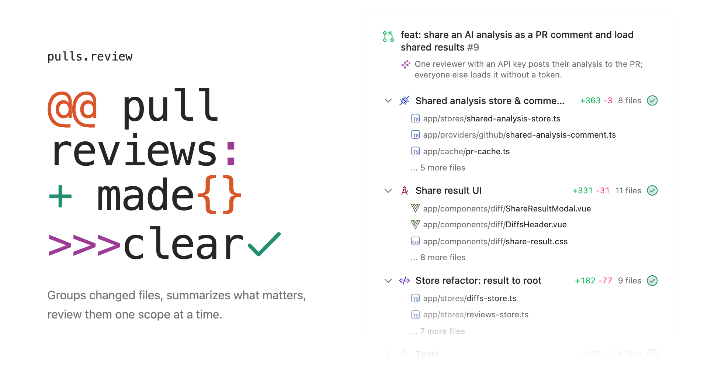

<picture>
  <source media="(prefers-color-scheme: dark)" srcset="./packages/app/public/og-dark.png">
  <source media="(prefers-color-scheme: light)" srcset="./packages/app/public/og.png">
  
</picture>

# [pulls.review](https://pulls.review)

> [!WARNING]
> Heavily work in progress.

Pull request review made simple. Groups changed files, summarizes what matters, and reviews them one scope at a time.

## Use on Website

To use pulls.review on the website, simply visit [pulls.review](https://pulls.review) and follow the instructions to connect your GitHub account and start reviewing pull requests directly in your browser.

## Use in GitHub

You can optionally install userscript to enhance the GitHub interface with pulls.review features.

Go to [pulls.review](https://pulls.review/) and scroll down to the GitHub section to install the userscript.

## Analyze pull requests from CI (Experimental)

Instead of each reviewer spending their own model key, let a workflow analyze every pull request once and post the result as a PR comment. pulls.review picks the comment up automatically for everyone who opens the PR there. Re-runs on an unchanged PR skip the model call.

```yaml
# .github/workflows/pulls-review.yml
name: pulls.review
on:
  # The analysis only reads the diff through the API and never checks out PR code,
  # so `pull_request_target` is safe here and lets fork PRs get a comment too.
  pull_request_target:
    types: [opened, synchronize, reopened]

permissions:
  pull-requests: write

jobs:
  analyze:
    runs-on: ubuntu-latest
    steps:
      - uses: antfu/pulls.review@main
        with:
          api-key: ${{ secrets.VERCEL_AI_GATEWAY_API_KEY }}
```

`provider` is inferred from the key you pass (`gateway` for a Vercel AI Gateway token, `anthropic`, or `openai-compatible` with `base-url`); set it explicitly, along with `model` and `locale`, when you want to.

The action is a thin wrapper around the `pulls-review` CLI, which works anywhere a GitHub token and a model key are in the environment:

```sh
GITHUB_TOKEN=... ANTHROPIC_API_KEY=... npx pulls-review owner/repo#123
```

Every variable also has a `PULLS_REVIEW_*` form that takes precedence (`PULLS_REVIEW_GITHUB_TOKEN`, `PULLS_REVIEW_PROVIDER`, `PULLS_REVIEW_API_KEY`, `PULLS_REVIEW_MODEL`, `PULLS_REVIEW_BASE_URL`, `PULLS_REVIEW_LOCALE`); `npx pulls-review --help` lists everything.

## Packages

| Package                                 | What it is                                                                           |
| --------------------------------------- | ------------------------------------------------------------------------------------ |
| [`packages/app`](./packages/app)        | The site at [pulls.review](https://pulls.review) and the github.com embed.           |
| [`@pulls.review/core`](./packages/core) | Fetching, parsing, grouping and summarizing diffs - runs in the browser and in Node. |
| [`pulls-review`](./packages/cli)        | The CLI the GitHub Action runs.                                                      |

## Credits

Inspired heavily by [Linear's PR review guides](https://linear.app/docs/diffs#guides), thanks for the inspiration.

## License

MIT License
